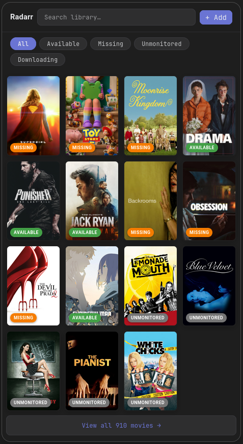
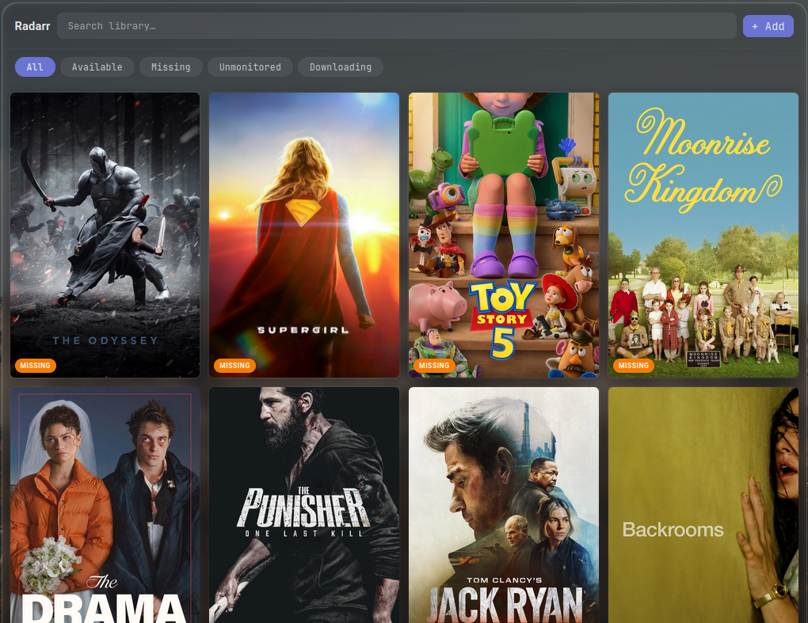
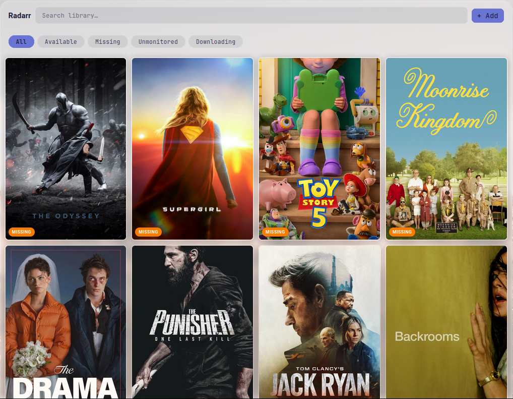
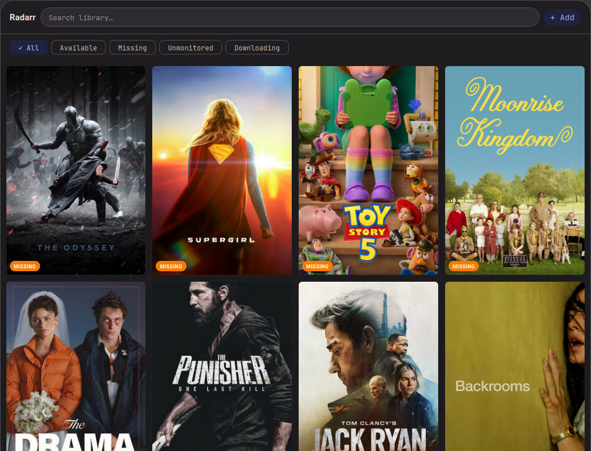
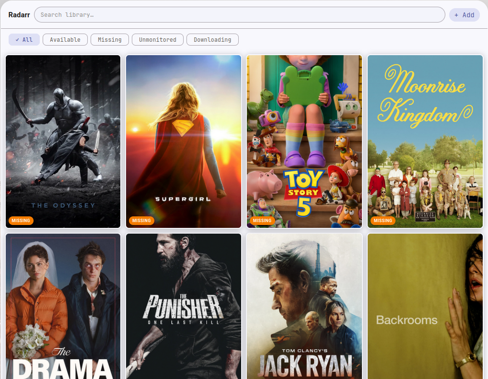
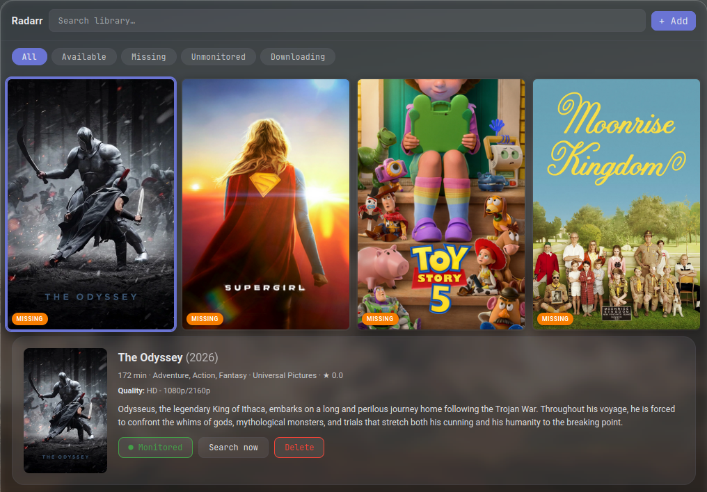
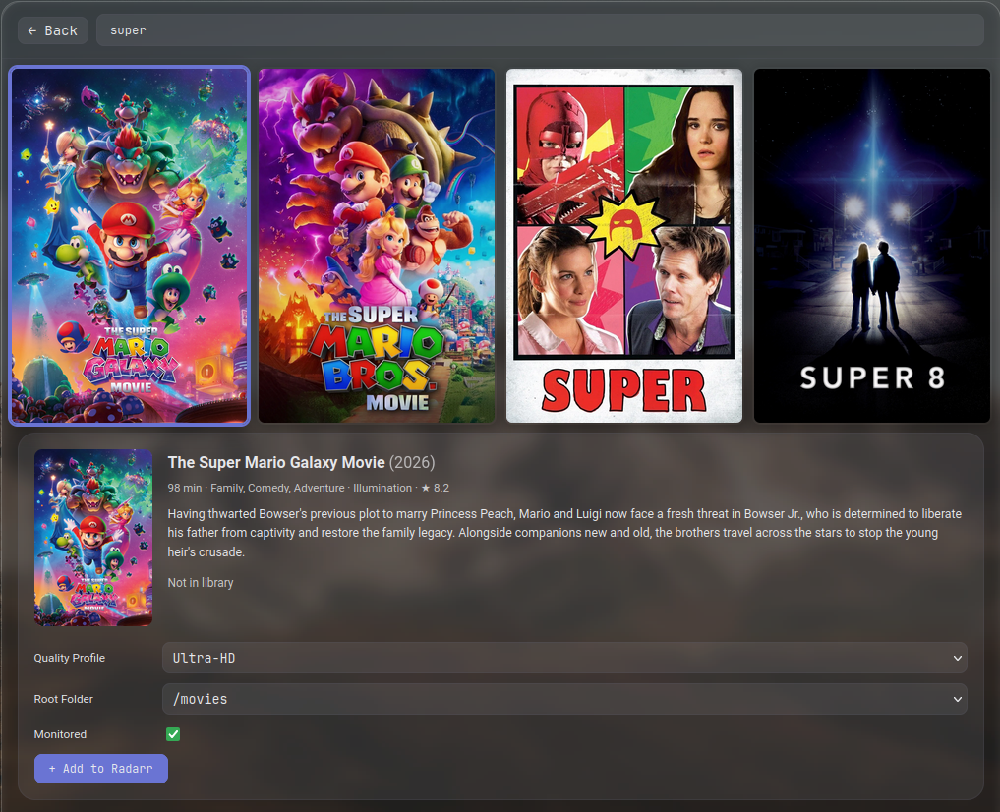

# Radarr Card

A Home Assistant integration that gives you full Radarr control from a single Lovelace card — browse your library, search TMDB, add movies, monitor downloads, and manage your collection without leaving your dashboard.

[](https://my.home-assistant.io/redirect/hacs_repository/?owner=devshm3&repository=radarr-card&category=integration)

[](https://www.buymeacoffee.com/devshm3)



<!-- Screenshot files live in docs/images/ — see docs/images/README.md for the
     expected filenames. Replace any placeholder that 404s with your own capture. -->

## Features

- **Poster grid** — browse your full library with filter tabs (All / Available / Missing / Downloading / Unmonitored)
- **Inline detail panel** — click any poster to expand quality, file info, ratings, and overview right in the grid
- **Unified search** — filters your library instantly; falls through to TMDB for titles not in your collection
- **Add movies** — pick quality profile, root folder, and monitored state, then add directly from the card
- **Download progress** — active downloads show a progress bar and time remaining, auto-refreshing every 15 seconds
- **Monitored toggle** — flip a movie between monitored and unmonitored without leaving the card
- **Manual search** — trigger Radarr to search for a specific movie immediately
- **Two-step delete** — confirm before removing a movie from Radarr
- **Summary sensors** — `total_movies`, `missing_movies`, `downloading_movies` per Radarr instance
- **Automatable services** — add, delete, refresh, toggle monitored, and trigger search via HA services
- **Multi-instance** — one card per Radarr instance (e.g. 4K + 1080p libraries)
- **Two looks** — choose **Glass** (theme-adaptive translucent) or **Material You** (MD3, auto light/dark)
- **Fully adaptive** — uses HA CSS variables, works with any theme

## Appearance

Choose the card's look in the visual editor (or with `appearance:` in YAML).
**Glass** adapts to your Home Assistant theme; **Material You** renders Material
Design 3 surfaces and auto-switches between light and dark with your HA mode.

### Glass

| Dark | Light |
|------|-------|
|  |  |

### Material You

| Dark | Light |
|------|-------|
|  |  |

### Other views

| Inline detail panel | Add a movie (TMDB search) |
|---------------------|---------------------------|
|  |  |

## Requirements

- Home Assistant 2024.1 or later
- Radarr v3 or later

## Installation

### Via HACS (recommended)

1. Click the badge above, or open HACS → Integrations → ⋮ → Custom repositories, add `https://github.com/devshm3/radarr-card`, category **Integration**
2. Download **Radarr Card** and restart Home Assistant
3. Go to **Settings → Devices & Services → Add Integration → Radarr Card**
4. Enter your Radarr URL (e.g. `http://192.168.1.10:7878`) and API key
5. Add the **Radarr Card Card** to any dashboard — the card JS loads automatically, no resource entry needed

### Manual

1. Copy `custom_components/radarr_hacs/` into your HA config `custom_components/` directory
2. Restart Home Assistant
3. Configure the integration via **Settings → Devices & Services → Add Integration → Radarr Card**

## Card Configuration

The visual editor auto-populates all fields. The card auto-detects your Radarr instance — no manual entry ID lookup needed.

### YAML options

```yaml
type: custom:radarr-hacs-card
entry_id: <your_entry_id>        # auto-filled by the editor
card_title: Radarr               # optional header override
appearance: glass                # glass | material (Material You; auto light/dark)
columns: 4                       # poster grid columns (2–8)
page_size: 25                    # movies shown before "View all"
default_sort: added              # added | title | year | status
default_filter: all              # all | available | missing | downloading | unmonitored
poster_radius: 8                 # poster corner radius in px
show_status_badges: true         # status overlay on posters
show_filter_counts: true         # movie counts on filter tabs
show_quality: true               # quality profile in movie detail
show_file_info: true             # file size and codec in movie detail
show_refresh_button: true        # manual refresh button in header
```

### Option reference

| Option | Default | Description |
|--------|---------|-------------|
| `entry_id` | — | Integration entry ID (auto-filled by the editor) |
| `card_title` | `Radarr` | Card header title |
| `appearance` | `glass` | Card look: `glass` (theme-adaptive translucent) or `material` (Material You / MD3, follows HA light/dark mode) |
| `columns` | `4` | Poster grid columns (2–8) |
| `page_size` | `25` | Movies shown before "View all" (10 / 15 / 25 / 50) |
| `default_sort` | `added` | Initial sort order |
| `default_filter` | `all` | Active filter tab on load |
| `poster_radius` | `8` | Poster corner radius in px |
| `show_status_badges` | `true` | Coloured status badge on each poster |
| `show_filter_counts` | `true` | Movie count bubble on each filter tab |
| `show_quality` | `true` | Quality profile name in the detail panel |
| `show_file_info` | `true` | File size and video codec in the detail panel |
| `show_refresh_button` | `true` | Manual refresh button in the card header |

## Sensors

The integration creates three sensors per configured Radarr instance:

| Sensor | Description |
|--------|-------------|
| `sensor.radarr_hacs_total_movies` | Total number of movies in the library |
| `sensor.radarr_hacs_missing_movies` | Monitored movies without a file |
| `sensor.radarr_hacs_downloading_movies` | Movies currently downloading |

## Services

| Service | Parameters | Description |
|---------|------------|-------------|
| `radarr_hacs.add_movie` | `entry_id`, `tmdb_id`, `title`, `year`, `quality_profile_id`, `root_folder`, `monitored` | Add a movie to Radarr |
| `radarr_hacs.delete_movie` | `entry_id`, `movie_id`, `delete_files` (optional) | Remove a movie from Radarr |
| `radarr_hacs.refresh_library` | `entry_id` | Trigger a full library refresh |
| `radarr_hacs.toggle_monitored` | `entry_id`, `movie_id`, `monitored` | Set monitored state on a movie |
| `radarr_hacs.trigger_search` | `entry_id`, `movie_id` | Trigger Radarr to search for a movie now |

All services are available under **Developer Tools → Services** in Home Assistant.
